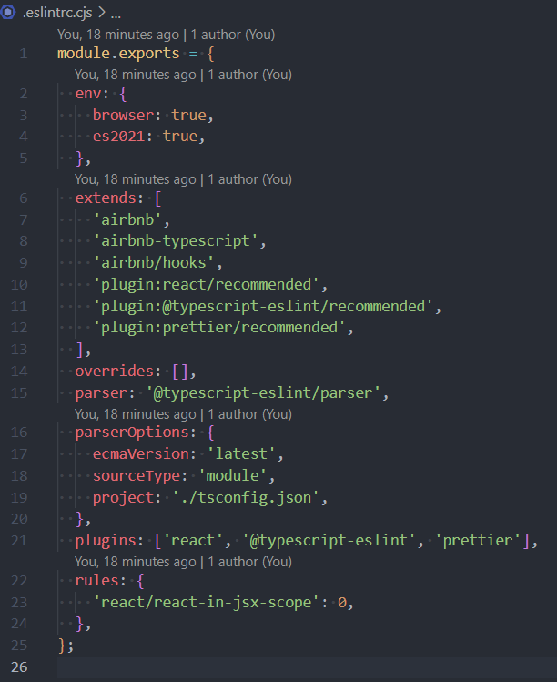

# setting-up-vite-react-typescript-eslint-vitest-testing-library-and-react-router

course URL - https://www.youtube.com/watch?app=desktop&v=cchqeWY0Nak

## eslint & prettier

1. npm create vite@latest
2. npm i -D eslint
3. npx eslint --init
4. npx install-peerdeps --dev eslint-config-airbnb.
5. change the "extends" in the .eslintrc.cjs to -> extends: ['airbnb', 'airbnb/hooks', 'plugin:react/recommended', 'plugin:@typescript-eslint/recommended'],
6. npm i -D eslint-config-airbnb-typescript.
7. Add to the "extends" in the .eslintrc.cjs -> 'airbnb-typescript'
8. change the "parserOptions" in the .eslintrc.cjs to -> parserOptions: {
   ecmaVersion: 'latest',
   sourceType: 'module',
   project: './tsconfig.json',
   },
9. change the "include" in the tsconfig.json to -> "include": [".eslintrc.cjs", "src"],
10. npm i -D prettier eslint-config-prettier eslint-plugin-prettier
11. create .prettierrc.cjs file and write inside -> module.exports = {
    trailingComma: 'es5',
    tabWidth: 2,
    semi: true,
    singleQuote: true,
    };
12. change the "plugins" in the .eslintrc.cjs to -> plugins: ['react', '@typescript-eslint', 'prettier'],
13. Add to the end of the "extends" array in the .eslintrc.cjs -> 'plugin:prettier/recommended',
    

## vitest

1. npm i -D vitest
2. change the vite.config.ts as follow ->
   /_ eslint-disable import/no-extraneous-dependencies _/
   /// <reference types="vitest" />
   /// <reference types="vite/client" />

import { defineConfig } from 'vite';
import react from '@vitejs/plugin-react';

// https://vitejs.dev/config/
export default defineConfig({
plugins: [react()],
test: {
globals: true,
environment: 'jsdom',
setupFiles: ['./src/setupTests.ts'],
},
});

3. npm i -D @testing-library/react @testing-library/jest-dom
4. create setupTests.ts file and write inside it ->
   /_ eslint-disable import/no-extraneous-dependencies _/
   import matchers from '@testing-library/jest-dom/matchers';
   import { expect } from 'vitest';

expect.extend(matchers);
